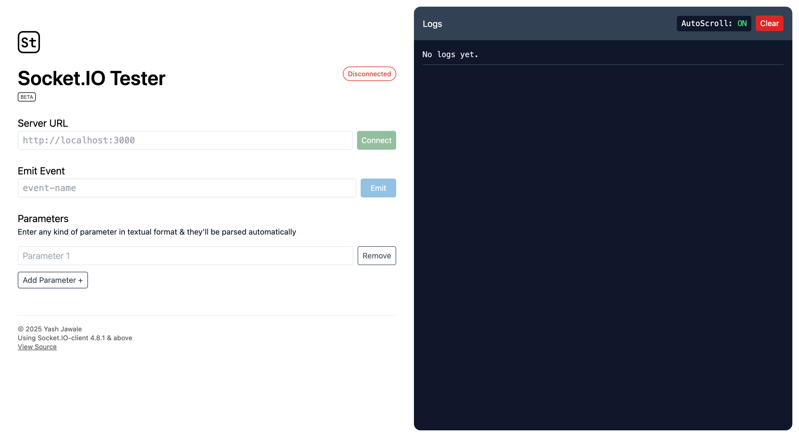

# SocketIO Tester

A simple web app for testing SocketIO connections

## Bug reports & Feature requests
Submit an issue describing the problem you're facing or the features you'd like to be implemented.

## Contribute
- Fork the repository
- Make changes & submit a Pull Request along with accompanied issue

## Tech Stack
- ReactJS
- TailwindCSS
- SocketIO

---

